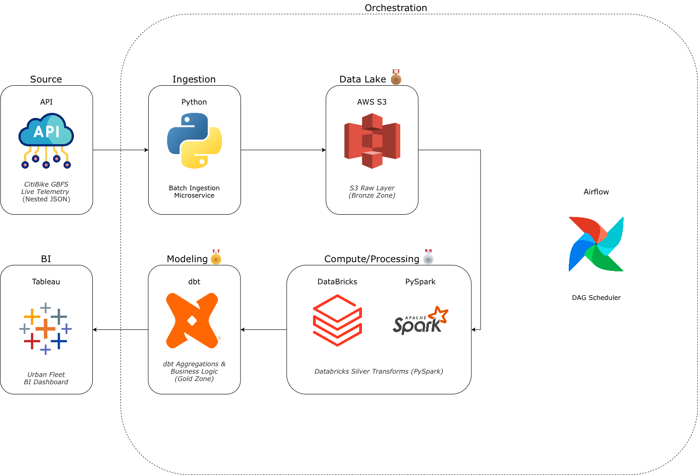

# Urban Logistics Data Lakehouse 🚲
**End-to-End Mobility Telemetry Pipeline**

## 📖 Project Overview
(Business Requirements document placeholder)

## 🏗 Architecture & System Design

### 🛠 Tech Stack
*   **Data Source:** Live CitiBike NYC GBFS REST APIs
*   **Language:** Python (3.x)
*   **Cloud Infrastructure:** Amazon Web Services (S3, IAM)
*   **Data Lake Compute:** Databricks & PySpark
*   **Data Modeling:** dbt (Data Build Tool)
*   **Orchestration:** Apache Airflow
*   **Visualization:** Tableau

## 📁 Repository Structure
(tree layout placeholder)

## 🚀 Execution Instructions
(local replication instructions placeholder)